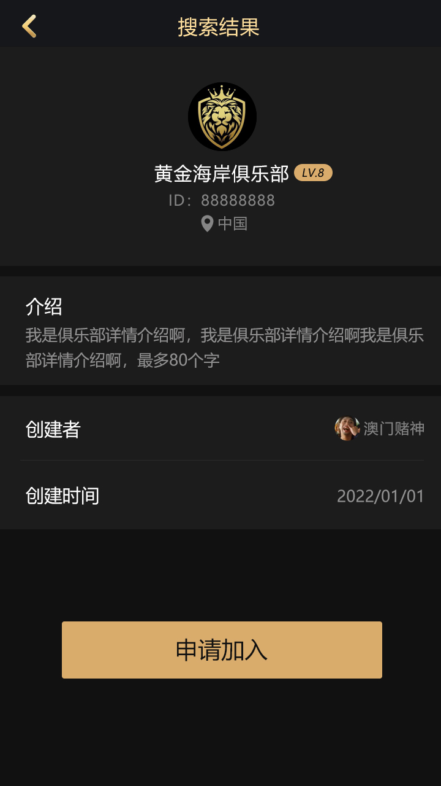
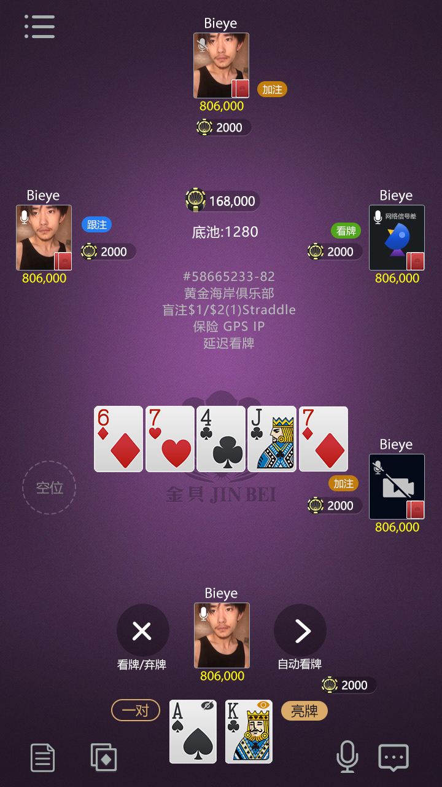
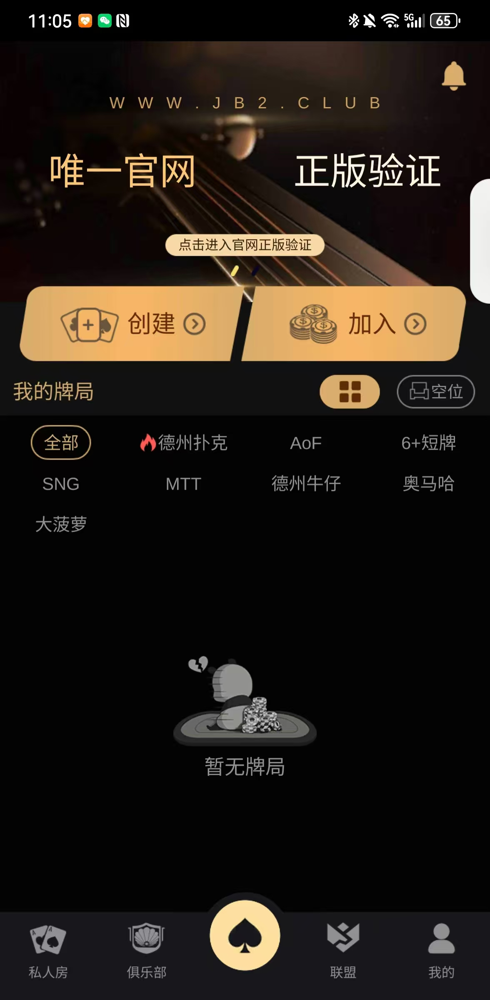
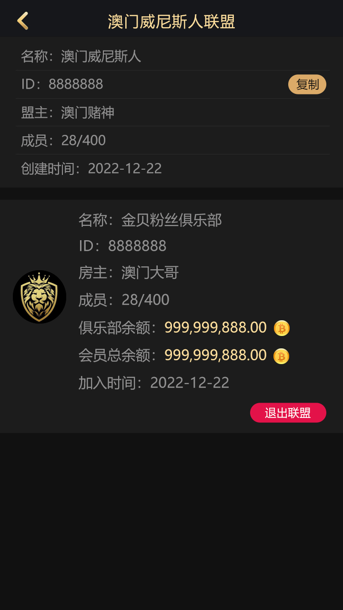
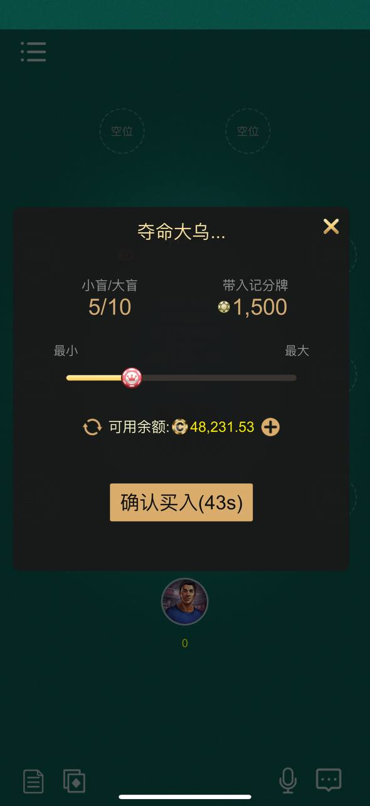

# 德州扑克平台源码｜德州源码 |德州俱樂部| Texas Holdem Poker Platform Source Code

[简体中文](README.md) | [繁體中文](README.zh-TW.md) | [English](README.en.md)

## 运营多年，支持8种语言，十多个德州玩法+私人局+俱乐部+大联盟

## 项目定位

本仓库聚焦 **Texas Holdem Poker Platform Source Code**，可用于展示德州扑克大厅、俱乐部、联盟系统、私人局、MTT 赛事、玩家中心、赠币功能和多人在线扑克平台能力。

## 🚀 Introduction | 项目介绍 | 專案介紹

This is a **complete Texas Hold'em poker platform source code**, designed for real-world deployment.
  玩法有：德州扑克/短牌/奥马哈/AOF/德州赛事/百人德州/德州牛仔 /SNG/MTT 
Includes:
- 🏠 Club System (俱乐部系统)
- 🏆 Tournament System (MTT / SNG)
- 🎮 Private Room (私人房间)
- ⚡ Real-time Multiplayer Engine
- 💰 Payment & Rake System
- 🛠 Admin Management System

适用于：
- 棋牌游戏开发 / 棋牌平台搭建
- 海外项目 / 出海运营
- 创业项目 / 商业变现
- 二次开发 / 定制开发

## 🎯 What This Project Can Do For You | 项目价值 | 專案價值

✔ Launch your own poker platform  
✔ Generate revenue (rake / tournaments / club system)  
✔ Save 6–12 months development time  
✔ Build a scalable online gaming business  

✔ 搭建自己的德州扑克平台  
✔ 实现盈利（抽水 / 比赛 / 俱乐部）  
✔ 节省6–12个月开发时间  
✔ 构建可扩展游戏平台  

✔ 建立自己的德州撲克平台  
✔ 實現盈利（抽水 / 比賽 / 俱樂部）  
✔ 節省6–12個月開發時間  
✔ 構建可擴展遊戲平台  
👉 Perfect for / 适用于 / 適用於：
- Startup founders / 创业者 / 創業者  
- Game developers / 游戏开发 / 遊戲開發  
- Casino platform operators / 棋牌运营 / 棋牌運營  
- Overseas business / 出海项目 / 海外市場  
## 🚀 System Overview | 项目介绍 | 專案介紹

This is a **complete Texas Hold'em poker platform source code**, including:

- 🏠 Club System (俱乐部 / 俱樂部)
- 🏆 Tournament System (MTT / SNG 比赛)
- 🎮 Private Room System (私人房间 / 私人房間)
- ⚡ Real-time Multiplayer Engine (实时对战 / 即時對戰)
- 💰 Payment & Rake System (盈利系统 / 盈利系統)
- 🛠 Admin Management Panel (后台系统 / 後台系統)

---

---

## 💰 Monetization (核心盈利能力)

- ✔ Game rake (每局抽水)
- ✔ Tournament fees (比赛报名费)
- ✔ Club revenue (俱乐部盈利)
- ✔ Agent / affiliate system (代理分佣)

👉 Designed for real business profit

---

## ⚙️ Technical Strength

- ⚡ High-performance C++ + Node.js architecture  
- 📡 Real-time multiplayer (WebSocket)  
- 🔒 Anti-cheat & secure system  
- 🧩 Scalable for high concurrency  

---
## 🧠 Why Choose This Project | 为什么选择 | 為什麼選擇

| Feature | This Project | Build Yourself |
|--------|------------|---------------|
| Development Time | ✅ 7–15 days | ❌ 6–12 months |
| Cost | ✅ Low | ❌ Very high |
| Stability | ✅ Production-ready | ❌ Risky |
| Monetization | ✅ Ready | ❌ Need design |
| Deployment | ✅ Easy | ❌ Complex |

👉 Save time, reduce risk, start earning faster  
👉 更快上线，更快盈利  
👉 更快上線，更快盈利  
## 产品截图

---

---

## 🚀 Commercial Support

✔ Custom development  
✔ Feature expansion  
✔ Deployment assistance  
✔ Long-term maintenance  

适用于 / 適用於：
- 棋牌游戏开发 / 棋牌平台  
- 出海项目 / 海外运营  
- 创业项目  
- 二次开发 / 定制开发  
---

## 📞 Contact 

📧 Email: ttpoker40@gmail.com  

💬 Telegram: @alibabama401  

---

## 🔥 Urgency / CTA

⚠️ Limited availability for custom support  
⚠️ Serious buyers only  

👉 Contact now before slots are full  

---

## 🔍 Keywords 

Texas Hold'em poker source code, online poker platform, poker business solution, multiplayer poker server, casino game system  
德州扑克源码, 德州扑克平台, 在线德州扑克, 棋牌游戏开发, 棋牌源码  

---

## ⚠️ Disclaimer

For educational purposes only.  
仅供学习参考，请遵守法律法规。  

