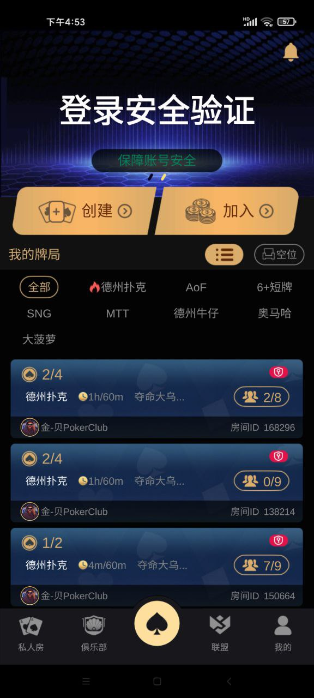
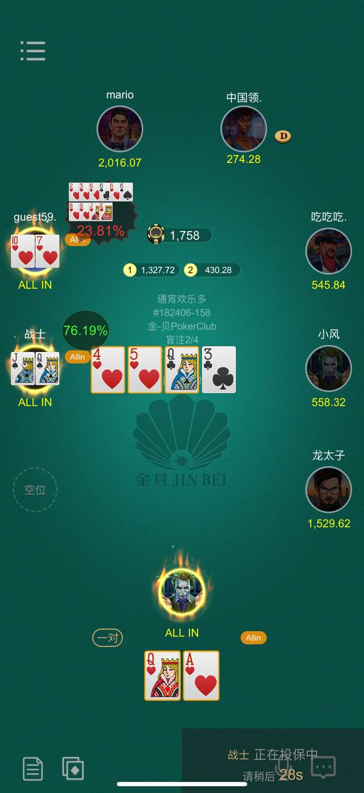

# 德州撲克俱樂部原始碼與私人局平台｜好友局、聯盟與即時協議

[简体中文](README.zh-CN.md) | [台灣繁體](README.zh-TW.md) · [香港繁體](README.zh-HK.md) | [English](README.en.md) | [GitHub Pages](https://alibabama401.github.io/Texas-Holdem-Poker-Platform-Source-Code/)

面向多人撲克產品評估和伺服器協議研究的公開資料庫。倉庫提供登入、使用者狀態和服務映射等 C++ 回呼，以及俱樂部、聯盟、私人房、SNG、MTT 與牌局記錄相關 Protobuf 定義。

> **範圍說明 / 范围说明：** 本倉庫是部分原始碼與協議參考，不是可直接編譯或上線的完整平台。公開檔案缺少完整依賴、建置腳本、資料庫、服務入口、Unity 場景和後台前端。

## 產品截圖

<table>
<tr><td width="50%"> <strong>多玩法大廳與房間列表</strong></td><td width="50%"> <strong>俱樂部建立介面</strong></td></tr>
<tr><td width="50%"> <strong>聯盟系統介面</strong></td><td width="50%"> <strong>MTT 賽事盲注資訊</strong></td></tr>
<tr><td width="50%"> <strong>好友私人牌局</strong></td><td width="50%"> <strong>德州撲克遊戲介面</strong></td></tr>
</table>

## 可核驗功能

- **C++ 回調 / 回呼：** 登錄/登入令牌、連接/連線映射、用戶/使用者資料、在線/線上狀態、房間狀態和退出處理。
- **俱樂部、聯盟與私人房：** 建立、加入、搜尋、審核、成員、職位、帳單、牌桌和聯盟訊息。
- **SNG 與 MTT：** 賽事房間、盲注、報名費、獎勵、排名、重購和退款欄位。
- **德州協議：** `dz.proto`、`GameRecord.proto` 與 `Friends.proto` 提供牌局、記錄和社交資料結構。
- **產品素材：** 12 張本地截圖和一個影片，展示大廳、俱樂部、聯盟、賽事、私人房與牌桌介面。

## Texas Hold’em 基本玩法

每位玩家獲得兩張私有底牌。翻牌、轉牌和河牌依序公開五張公共牌；各輪可根據規則過牌、跟注、加注或棄牌。玩家從七張可用牌中組成最佳五張牌。倉庫協議還包含 SNG 與 MTT 賽事相關欄位。

## 公開檔案映射

| 公開檔案 | 可核驗內容 |
|---|---|
| `AsyncLoginCallback.*` | 登入結果、連線映射與狀態通知 |
| `AsyncGetUserCallback.*` | 裝置、平台、渠道、區域和機器人標記 |
| `AsyncUserServerMapCallback.*` | 線上、離線與房間狀態查詢 |
| `CommonStruct.proto` | 俱樂部、聯盟、賽事、私人房和金幣流水列舉 |
| `config.proto` | 房間、MTT/SNG、盲注、報名費、獎勵和俱樂部設定 |
| `dz.proto / GameRecord.proto` | 德州訊息欄位與牌局記錄結構 |

## 評估與使用

1. 先查看 `SOURCE-INVENTORY.md` 和實際公開檔案。
2. 補齊缺少的標頭檔、生成程式碼、依賴、服務實作、資料庫和配置。
3. 建立可重複建置、測試、安全和部署文件。
4. 請倉庫所有者釐清 `License.md` 中 MIT 與商用/保留權利文字的關係。
5. 正式使用前審核當地法規、平台規則、安全和遊戲公平性。

## Contact

Email: ttpoker40@gmail.com  
Telegram: [@alibabama401](https://t.me/alibabama401)

## 搜尋關鍵詞

德州撲克原始碼、德州撲克平台、C++ 撲克伺服器、Protobuf 撲克協議、撲克俱樂部、私人房、SNG、MTT、Texas Holdem source code。
